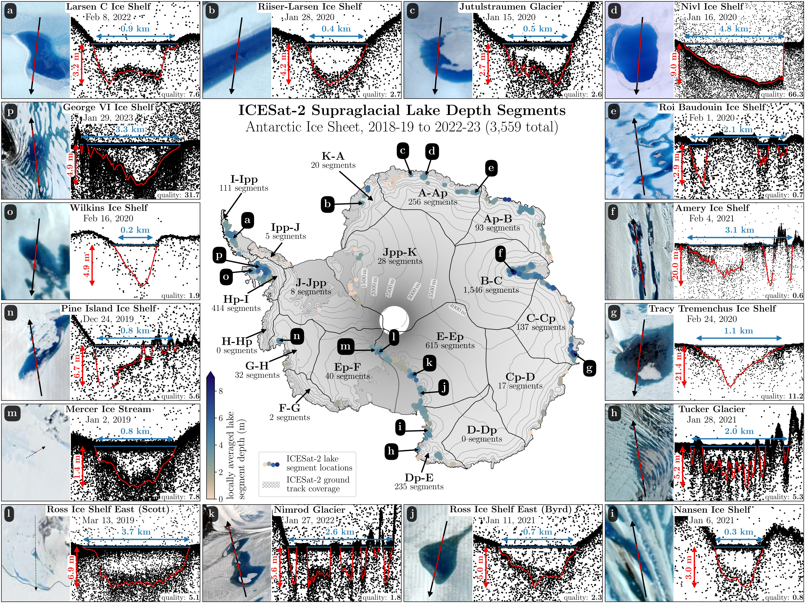
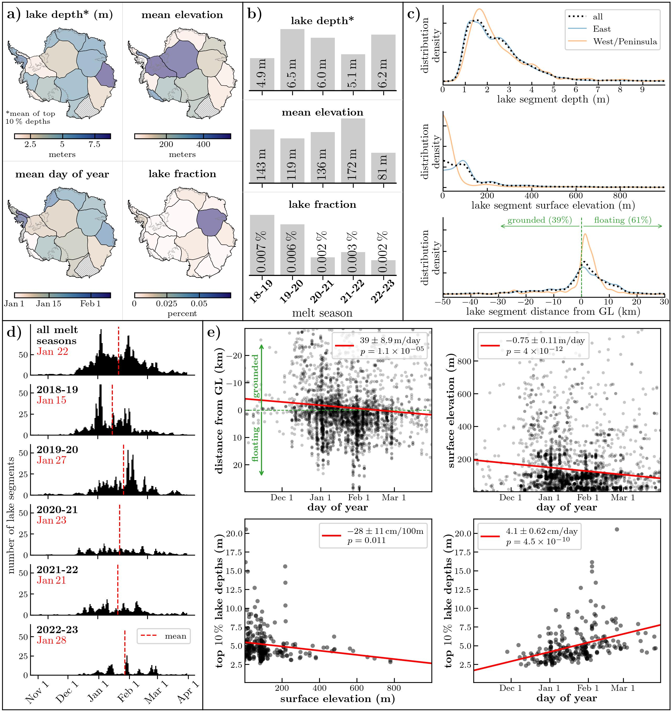

# Work in progress

Data to be published after the dissertation crunch and a bit of sleep, vacation and prioritization of personal relationships...

main figure showing all ICESat-2 lake segment locations, and some examples of the underlying data across Antarctica (2018/19 - 2022/23)

spatiotemporal variability and trends in the ICESat-2 lake depth data across Antarctica

